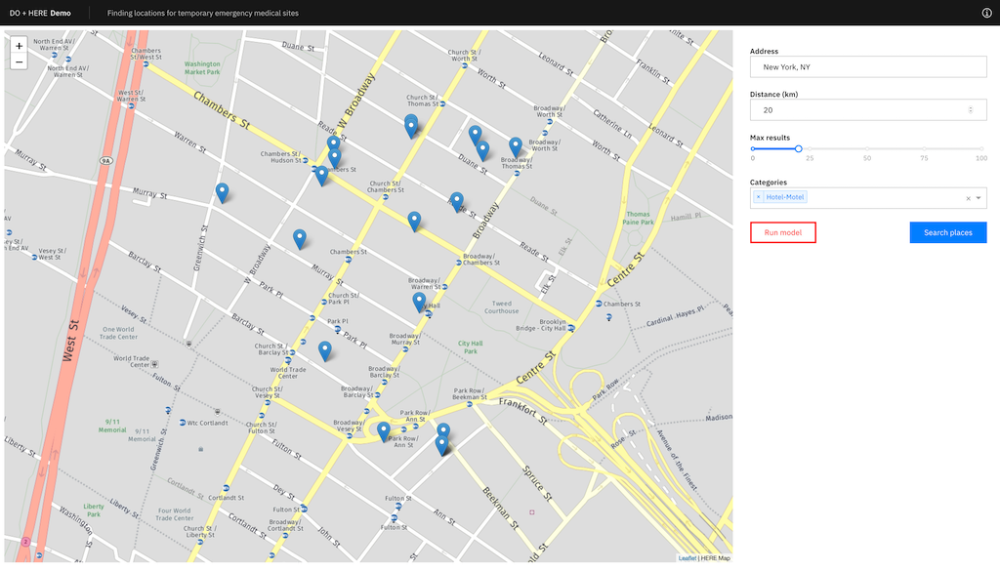

# Finding optimal locations for temporary emergency medical sites

In this code pattern, we will create an application using IBM Decision Optimization, Watson Machine Learning, HERE Technologies, and Plotly Dash. Using places data provided by HERE, a Decision Optimization model deployed in Watson Machine Learning will find the optimal locations to establish temporary medical sites.

When the reader has completed this pattern, they will understand how to:

- Create a Decision Optimization model in Watson Studio
- Deploy a Decision Optimization model in Watson Machine Learning
- Use HERE's Geocoding and Search API to pinpoint geo-coordinates and get Places data
- Run a Plotly Dash application with Decision Optimization and HERE Technologies integration to identify locations for temporary emergency medical sites


## Flow

1. Decision Optimization model is built and deployed to Watson Machine Learning
1. The user interacts with the application
1. User inputs a location to request a list of Places in the vicinity
1. The input is sent to HERE Location services and returned Places are displayed in the UI
1. User triggers a request to find optimal sites from the list of Places
1. The Places data is sent to Watson Machine Learning and returned sites are displayed in the UI


## Included components

- [IBM Decision Optimization](https://www.ibm.com/analytics/decision-optimization): IBM Decision Optimization represents a family of optimization software that delivers prescriptive analytics capabilities to enable organizations to make better decisions and deliver improved business outcomes.
- [Watson Studio](https://www.ibm.com/cloud/watson-studio): Analyze data using RStudio, Jupyter, and Python in a configured, collaborative environment that includes IBM value-adds, such as managed Spark.
- [Watson Machine Learning](https://www.ibm.com/cloud/machine-learning): IBM Watson Machine Learning makes it easy and cost-effective to deploy AI and machine learning assets in public, private, hybrid or multicloud environments.


## Featured technologies

- [HERE Location Services](https://www.here.com/products/location-based-services): Solve complex location problems from geofencing to custom routing with HERE Location services.
- [Plotly Dash](https://plotly.com/dash/): The Dash platform empowers Data Science teams to focus on the data and models, while producing and sharing enterprise-ready analytic apps that sit on top of Python and R models.
- [Jupyter Notebooks](https://jupyter.org/): An open-source web application that allows you to create and share documents that contain live code, equations, visualizations, and explanatory text.


## Steps

1. [Clone the repo](#clone-the-repo)
1. [Generate an API Key from the HERE Developer Portal](#generate-an-api-key-from-the-here-developer-portal)
1. [Provision a Watson Machine Learning service](#provision-a-watson-machine-learning-service)
1. [Build and deploy the Decision Optimization model](#build-and-deploy-the-decision-optimization-model)
1. [Deploy the application](#deploy-the-application)
1. [Use the application](#use-the-application)


### Clone the repo

Clone the [`do-here-demo`](https://github.com/IBM/do-here-demo) repository locally. In a terminal, run:

```shell
git clone https://github.com/IBM/do-here-demo
```

### Generate an API Key from the HERE Developer Portal

The application uses HERE Location Services for maps and searching.

To access these services, you'll need an API key. Follow the instructions outlined in the [HERE Developer Portal](https://developer.here.com/sign-up) to [generate an API key](https://developer.here.com/documentation/authentication/dev_guide/topics/api-key-credentials.html).

### Provision a Watson Machine Learning service

- If you do not have an IBM Cloud account, [register for a free trial account](https://cloud.ibm.com/registration).
- Log into [IBM Cloud](https://cloud.ibm.com/login)
- Create a [create a Watson Machine Learning instance](https://cloud.ibm.com/catalog/services/machine-learning)

### Build and deploy the Decision Optimization model

- Log into [IBM Watson Studio](https://dataplatform.cloud.ibm.com/)
- Create a new [Project](https://dataplatform.cloud.ibm.com/docs/content/wsj/getting-started/projects.html)
- [Import the notebook](https://dataplatform.cloud.ibm.com/docs/content/wsj/analyze-data/creating-notebooks.html) `do_with_wml.ipynb` into the new Project  
    > **Note** The URL for the notebook is  
    > `https://raw.githubusercontent.com/IBM/do-here-demo/master/notebook/do_with_wml.ipynb`
- Run the imported notebook to build the Decision Optimization model and deploy it into Watson Machine Learning
    > **Note**: You will need to update one of the notebook cells to include your Watson Machine Learning instance credentials. [Follow these steps](https://dataplatform.cloud.ibm.com/docs/content/wsj/analyze-data/ml-get-wml-credentials.html) to find the service credentials.
- Make note of the model deployment GUID

### Deploy the application

If you do not have the IBM Cloud CLI installed, [download and install the IBM Cloud CLI](https://www.ibm.com/cloud/cli) before continuing.

From a command line:

1. Go into the [`dash-app`](https://github.com/IBM/do-here-demo/blob/master/dash-app/) directory of the cloned repository

    ```shell
    cd <path_to_cloned_repo>/dash-app
    ```

- Make a copy of the `.env.example` file in the `dash-app` directory in the GitHub repository, and name it `.env`.

    ```shell
    cp .env.example .env
    ```

- Edit the newly created `.env` file and update all variables

- Log in to your IBM Cloud account using the IBM Cloud CLI:
    ```shell
    ibmcloud login
    ```
- Target a Cloud Foundry org and space
    ```shell
    ibmcloud target --cf
    ```
- Push the app to IBM Cloud
    ```shell
    ibmcloud app push
    ```
- The server can be accessed at the URL displayed in the console after app has been pushed to IBM Cloud (for example, https://some-random-route.bluemix.net).

### Use the application

The web app presents a dashboard containing map view and some form fields. Change the default form values and click **Search places** to view Places on the map based on the form values. Click on the **Run model** button to pass the current Places data to the Decision Optimization model. The map gets updated to show optimal places returned by the model.




## Resources

- [Documentation for IBM Decision Optimization CPLEX Modeling for Python](https://ibmdecisionoptimization.github.io/docplex-doc/)
- [Decision Optimization and Machine learning on IBM Watson Studio and Watson machine learning](https://github.com/nmdoshi/HandsOnLabDOWS)

